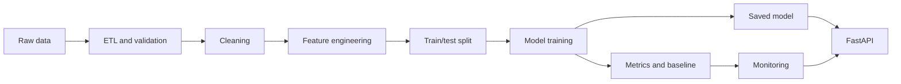
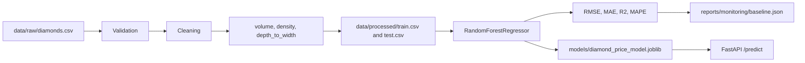

# Automation ML Diamonds

[](https://www.python.org/)
[](https://fastapi.tiangolo.com/)
[](https://docs.pytest.org/)
[](https://docs.docker.com/compose/)
[](LICENSE)

Educational MLOps project for the course "Automation of Machine Learning".

Current version: `1.0.0`

The project demonstrates a complete, reproducible ML workflow for a tabular regression task: predicting diamond price (`price`) from the Kaggle Diamonds dataset.

This is a course/demo project, not an enterprise production system. The focus is on stability, clarity, local reproducibility, tests, Docker, CI/CD, and understandable project structure.

## Business Task

Predict diamond price using these input features:

- `carat`
- `cut`
- `color`
- `clarity`
- `depth`
- `table`
- `x`
- `y`
- `z`

Target: `price`

Task type: regression

Dataset: [Kaggle Diamonds Dataset](https://www.kaggle.com/datasets/shivam2503/diamonds)

## Why Diamonds Dataset

- It is a simple and understandable tabular dataset.
- It contains both numeric and categorical features.
- It is suitable for regression and easy to explain during a course defense.
- It allows the project to demonstrate ETL, preprocessing, feature engineering, model training, API, tests, Docker, CI/CD, and monitoring without unnecessary NLP complexity.

## Architecture Diagram



## Pipeline Diagram



## What Is Implemented

- ETL pipeline with validation, cleaning, feature engineering, and processed data output.
- Real model training with `RandomForestRegressor`.
- Real metrics calculated after training: RMSE, MAE, R2, MAPE.
- FastAPI service with health, prediction, and model information endpoints.
- Lightweight monitoring:
  - baseline metrics;
  - numeric data drift;
  - model degradation detection;
  - CPU/RAM/disk usage with `psutil`.
- Tests using small synthetic DataFrames, so the full Kaggle dataset is not required.
- Docker and Docker Compose configuration.
- GitHub Actions workflow for tests and Docker image build.

## Project Structure

```text
.
├── data/
│   ├── raw/
│   └── processed/
├── src/
│   ├── app.py
│   ├── data_processing.py
│   ├── infrastructure_monitoring.py
│   ├── model_training.py
│   └── monitoring.py
├── tests/
│   ├── test_api.py
│   ├── test_data.py
│   ├── test_model.py
│   └── test_monitoring.py
├── docker/
│   ├── Dockerfile
│   └── prometheus.yml
├── .github/workflows/
│   └── ci-cd.yml
├── models/
├── reports/
│   ├── figures/
│   └── monitoring/
├── presentation/
│   └── presentation.md
├── run_pipeline.py
├── docker-compose.yml
├── requirements.txt
└── README.md
```

## Quick Start

Create and activate a virtual environment on Windows:

```bash
python -m venv .venv
.venv\Scripts\activate
```

Install dependencies:

```bash
pip install -r requirements.txt
```

Run the full ML pipeline:

```bash
python run_pipeline.py
```

Expected output:

```text
Pipeline completed
rmse: 589.5855
mae: 483.1370
r2: 0.9631
mape: 7.0597
```

The exact values can differ if you replace the generated sample data with the full Kaggle dataset.

## Dataset Setup

For the real Kaggle dataset, place the CSV here:

```text
data/raw/diamonds.csv
```

If the file is missing, the project automatically creates a small deterministic diamonds-like sample dataset. This keeps tests, Docker builds, and local demos reproducible without manual Kaggle download.

## Running ETL

```bash
python -m src.data_processing
```

Expected output:

```text
Saved processed train/test data: train=400, test=100
```

Generated files:

- `data/raw/diamonds.csv` if no raw dataset existed;
- `data/processed/train.csv`;
- `data/processed/test.csv`;
- `data/processed/diamonds_processed.csv`.

## Training

```bash
python -m src.model_training
```

Expected output is a JSON object with real metrics:

```json
{
  "rmse": 589.5855030260883,
  "mae": 483.1369603844394,
  "r2": 0.9631170911086028,
  "mape": 7.059739162247622
}
```

Generated files:

- `models/diamond_price_model.joblib`;
- `models/metrics.json`;
- `reports/monitoring/baseline.json`.

## API

Start FastAPI locally:

```bash
uvicorn src.app:app --reload
```

Open API docs:

```text
http://127.0.0.1:8000/docs
```

Available endpoints:

- `GET /` - basic API message.
- `GET /health` - service and model status plus infrastructure metrics.
- `POST /predict` - predict diamond price.
- `GET /model/info` - model path, feature list, and saved metrics.

Example request body for `POST /predict`:

```json
{
  "carat": 0.5,
  "cut": "Ideal",
  "color": "E",
  "clarity": "SI1",
  "depth": 61.5,
  "table": 55,
  "x": 5.1,
  "y": 5.0,
  "z": 3.1
}
```

Example response:

```json
{
  "predicted_price": 4200.25,
  "message": "Prediction completed successfully."
}
```

If the model has not been trained yet, `/predict` returns HTTP 503 with an instruction to run training first. Importing the API does not crash when the model is absent.

## Tests

Run all tests:

```bash
pytest -v
```

Expected current result:

```text
18 passed
```

Optional coverage command if `pytest-cov` is installed:

```bash
pytest --cov=src --cov-report=term-missing
```

## Monitoring

Print current infrastructure metrics:

```bash
python -m src.infrastructure_monitoring
```

Example output:

```json
{
  "cpu_percent": 10.5,
  "ram_percent": 88.4,
  "disk_percent": 43.4
}
```

Monitoring is intentionally lightweight and educational. It demonstrates baseline metrics, drift checks, degradation checks, and system resource checks without external services.

## Docker

Build the image:

```bash
docker compose build
```

Run the API:

```bash
docker compose up
```

Expected behavior:

- the image installs Python dependencies;
- the image runs ETL and model training during build so the API has a model artifact inside the image;
- the API starts on port `8000`;
- docs are available at `http://127.0.0.1:8000/docs`.

## CI/CD

GitHub Actions workflow:

```text
.github/workflows/ci-cd.yml
```

It performs:

1. repository checkout;
2. Python setup;
3. pip dependency cache;
4. dependency installation;
5. Python compile check for `src` and `tests`;
6. `python -m pytest -v`;
7. Docker image build.

There is no deploy step, cloud integration, or secrets usage. This is intentional for a stable public course repository.

## Troubleshooting

### `ModuleNotFoundError`

Install dependencies in the active environment:

```bash
pip install -r requirements.txt
```

### `/predict` returns HTTP 503

Train the model first:

```bash
python -m src.model_training
```

### Kaggle dataset is missing

This is safe. The project will generate a deterministic sample dataset automatically. To use the real data, place `diamonds.csv` in `data/raw/`.

### Docker build fails because Docker Engine is unavailable

Start Docker Desktop, wait until the engine is running, then retry:

```bash
docker compose build
```

## Manual Screenshots To Add

Before submitting the project, add screenshots to the report or LMS submission if required:

- Swagger UI at `/docs`;
- `/health` endpoint response;
- GitHub Actions green workflow;
- Docker Compose running successfully.

## Future Improvements

- Add `pytest-cov` and publish coverage in CI.
- Add a small model comparison experiment.
- Add a simple monitoring dashboard or report export.
- Add screenshots to the final report after manual demonstration.

## Submission Notes

This repository demonstrates the requested educational MLOps components:

- ETL;
- preprocessing;
- model training;
- real metrics;
- API;
- tests;
- Docker;
- CI/CD;
- monitoring;
- documentation.

The project is ready for submission after adding the GitHub repository link and any required screenshots to the LMS.
